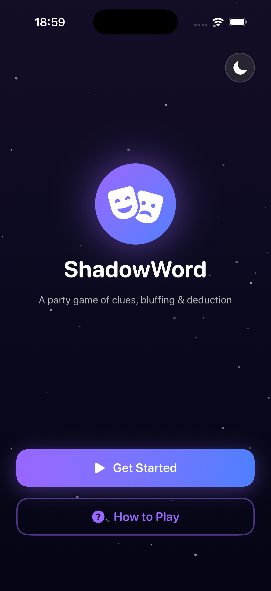
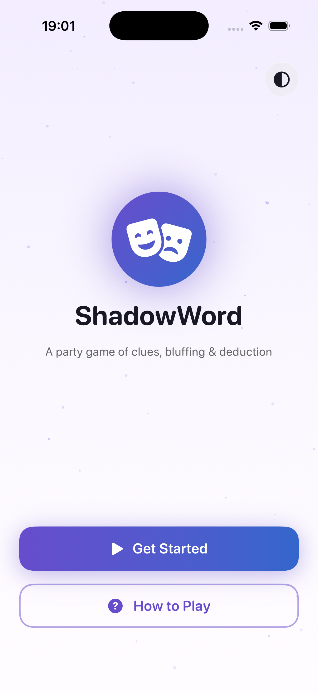
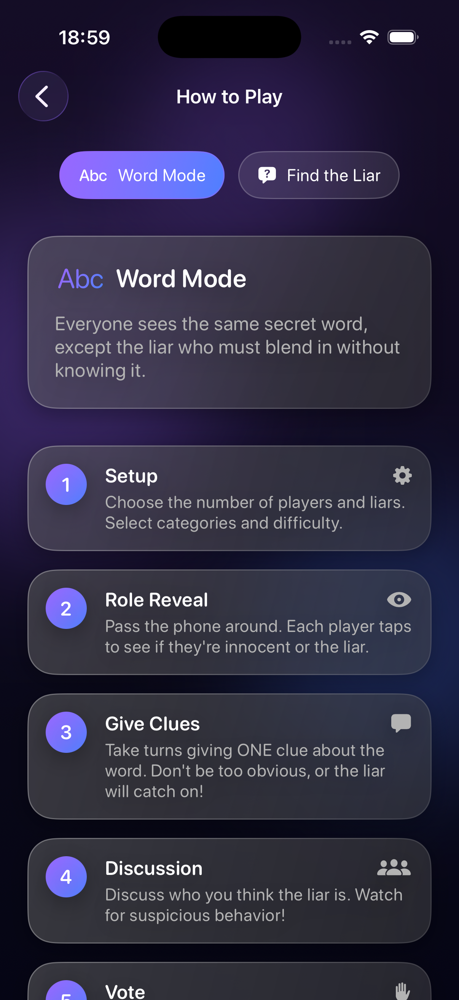
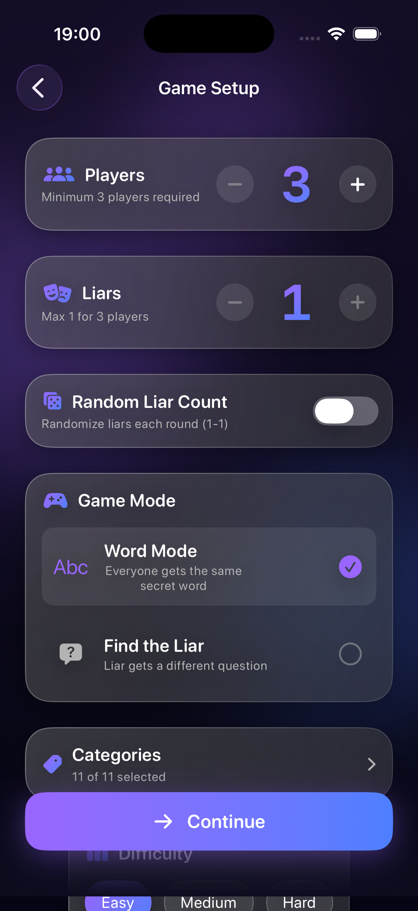
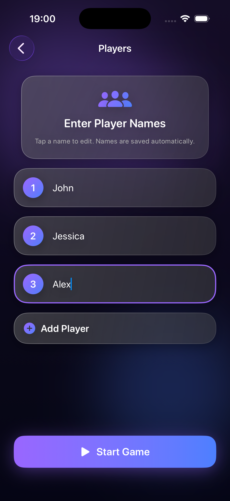
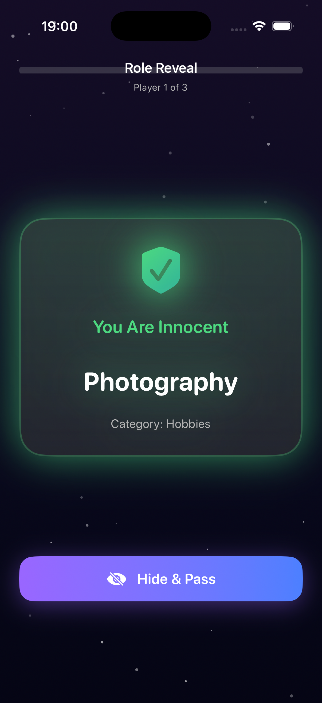
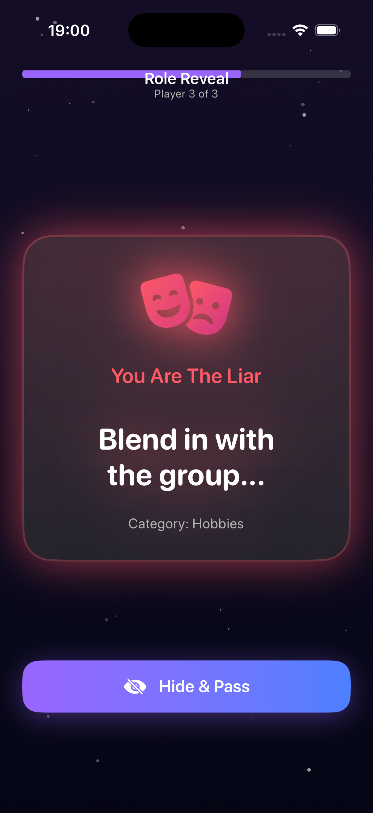
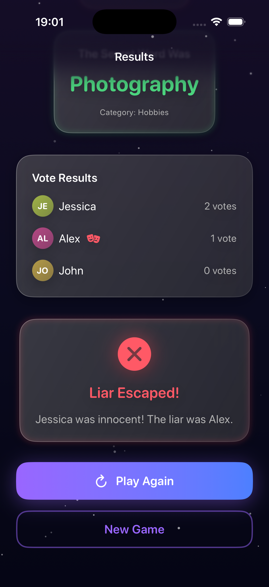

# 🎭 ShadowWord – Offline Party Bluffing Game

ShadowWord is a **pass-and-play party game** built with **Swift,SwiftUI**. Give clever clues, spot the bluffers, and vote out the liars before they guess the secret word. Everything runs **100% offline** so you can play anywhere with friends, family, or classmates.

---

## 🌀 About the Game

ShadowWord blends social deduction with quick setup and a polished, animated UI. Choose between two modes, hand the device around to reveal roles, trade clues, and vote for the liar. If the liar gets caught, they get one final chance to steal the win by guessing the word.

- Two modes: **Word** (classic secret word) and **Find the Liar** (different question)
- **3–100 players** with configurable liar counts (fixed or random)
- **11 categories, 330 words, 165 paired questions** with difficulty tuning
- Liar-only perks (optional category and hint), plus “liar never goes first”
- **Pass-and-play** reveal, discussion, voting, and liar’s last-guess flow
- **Haptics, glassmorphism UI, animated backgrounds**, and light/dark theme toggle
- Fully **offline** with persisted settings and player names

---

## 🧠 Technical Details

| Feature | Technology |
|---------|-------------|
| UI Framework | SwiftUI  |
| Architecture | MVVM with `@Observable` view models |
| State & Storage | AppStorage/UserDefaults via `PersistenceService` |
| Content | Embedded JSON/Swift data (`EmbeddedContent*.swift`) |
| Haptics | `HapticsService` for role/vote/result feedback |
| Animations | Custom particle/orb backgrounds, spring reveals |
| Design System | Centralized theme, typography, spacing in `ShadowWord/Components/Theme.swift` |
| Navigation | `NavigationStack` with pass-and-play flow control |

---

## 🪄 Game Flow

1) **Setup** – Choose player/liar counts, mode, categories, difficulty, and liar options.  
2) **Names** – Enter player names (auto-saved, supports up to 100).  
3) **Role Reveal** – Pass the device; each player sees their role/word/question.  
4) **Discussion** – Give one clue/answer each, starting from the chosen player.  
5) **Voting** – Pass to each player to cast a vote for the suspected liar.  
6) **Results** – Reveal liars, secret word/question, and vote breakdown.  
7) **Liar’s Guess** – If caught in Word mode, the liar can guess the word to steal victory.

---

## 🎯 Key Features

- **Dual Modes:** Classic secret-word play or asymmetric question pairs.  
- **Content Library:** 11 themed categories with 330 words, 165 question pairs, and difficulty-aware selection.  
- **Smart Setup:** Fixed or random liar counts, liar-start prevention, optional liar hints/category reveal.  
- **Pass-and-Play UX:** Guided handoff cards for reveals and voting with progress indicators.  
- **Results & Redemption:** Detailed vote breakdowns plus a liar-only last-chance guess.  
- **Polished Feel:** Glass cards, neon gradients, particle backgrounds, and tailored haptics.  
- **Offline-First:** All content embedded; no accounts or network required.

---

## 📸 Screenshots

Drop your captures in `Resources/screenshots/` and update the filenames below to showcase the flow:

  
  
  
   
   
   
   
   
   

---

## 🧩 Design System

ShadowWord uses a centralized design system to keep the glassy, neon look consistent:

- **Colors & Gradients:** `swGradientPrimary`, `swGradientLiar`, `swGradientInnocent`, adaptive text/background colors.
- **Typography:** Rounded display styles (`SWTypography`) for titles, buttons, secret words, counters.
- **Components:** `PrimaryButton`, `GlassCard`, `PlayerAvatar`, `CounterView`, `AnimatedBackground` for particles/orbs.
- **Spacing & Radius:** `SWSpacing` and `SWRadius` keep layout rhythm consistent across screens.

See `ShadowWord/Components/Theme.swift` for the palette and tokens.

---

## 👨‍💻 Author

**Batuhan Küçükaydın**  
Software Engineer | Computer Engineer | iOS Developer  
📫 [LinkedIn](https://linkedin.com/in/batuhankucukaydin) • [GitHub](https://github.com/batukucukaydin) • [Medium](https://medium.com/@batukucukaydin)

## ⭐️ Support

If you like this project, please consider giving it a star 🌟  
It really helps me keep building and improving!

## 📄 License
This project is released under the MIT License.
